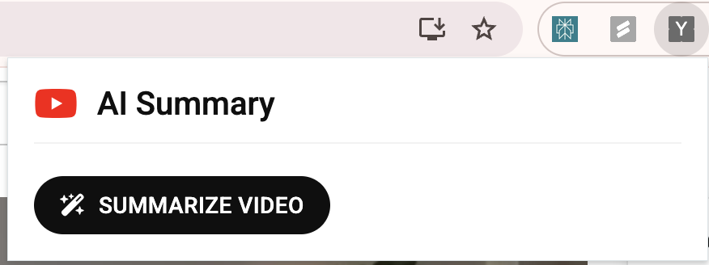

# YouTube Video Summarizer 🎥

<div align="center">
  
  
  
  
</div>

<p align="center">
  <strong>Get instant AI-powered summaries of YouTube videos while you watch!</strong>
</p>

## 📸 Screenshots

<div align="center">
  <h3>In-Page Summary Panel</h3>
  
  <p><em>Summary panel seamlessly integrated into YouTube's interface</em></p>

  <h3>Extension Popup</h3>
  
  <p><em>Modern popup interface matching YouTube's design</em></p>
</div>

## ✨ Features

- 🎥 **Automatic Transcript Extraction**: Seamlessly extracts transcripts from YouTube videos
- 🤖 **AI-Powered Summaries**: Uses Google's Gemini AI for intelligent video summarization
- 🔒 **Privacy First**: All processing happens locally - your data stays with you
- ⚡ **Instant Summaries**: Automatically generates summaries when you load a video
- 🎨 **YouTube-Style UI**: Modern interface that matches YouTube's design
- 🔄 **Manual Refresh**: Option to regenerate summaries anytime
- 🔑 **Simple Setup**: Easy API key management
- 🚀 **Efficient**: Fast processing with minimal resource usage

## 🔧 Installation

### From Release
1. Download the latest `youtube-summarizer-extension.zip` from [Releases](https://github.com/vikashprajapati/Youtube-Summarizer/releases)
2. Extract the ZIP file
3. Open Chrome and navigate to `chrome://extensions`
4. Enable "Developer mode" (top right toggle)
5. Click "Load unpacked" and select the extracted folder

### From Source
```bash
git clone https://github.com/vikashprajapati/Youtube-Summarizer.git
cd Youtube-Summarizer
# Load the src directory as an unpacked extension in Chrome
```

## 🚀 Quick Start

1. Install the extension
2. Get your Gemini API key from [Google AI Studio](https://makersuite.google.com/app/apikey)
3. Click the extension icon and enter your API key
4. Navigate to any YouTube video
5. Watch the summary appear automatically!

## 🔐 Privacy & Security

We take your privacy seriously:
- No data collection or tracking
- API keys stored securely in Chrome's storage
- Direct communication with Google's API
- No storage of video content or transcripts
- All processing happens locally on your machine

## 🛠️ Technical Details

- Built with JavaScript and Chrome Extension APIs
- Uses Manifest V3 for better security and performance
- Implements efficient transcript extraction methods
- Robust error handling and retry mechanisms
- Modern async/await patterns for better reliability

## 📝 Requirements

- Google Chrome browser
- Gemini API key
- YouTube videos with available transcripts

## 🤝 Contributing

Contributions are welcome! Feel free to:
- Report bugs
- Suggest features
- Submit pull requests

## 📄 License

This project is licensed under the MIT License - see the [LICENSE](LICENSE) file for details.

## 🙏 Acknowledgments

- Google's Gemini AI for powering the summarization
- YouTube's transcript feature
- All our contributors and users 